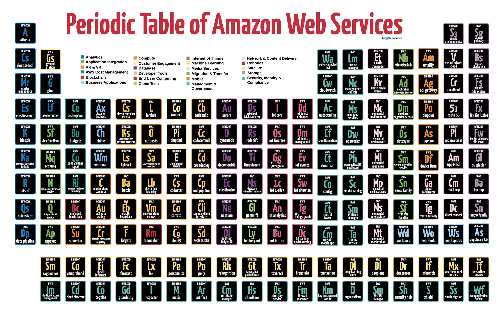

# Introduction

Cloud infrastructure is frustratingly complex. AWS especially so:

Which of the [200 and counting](https://aws.amazon.com/products/) services do I need? How do I configure them? Without prior DevOps expertise it can take days if not weeks of trial and error to set up a stack on AWS.

Then why not start on something simple like Heroku and only move to AWS if and when you need to? Short answer: that's easier said than done, check out [Digger vs Other](./digger-vs-other) for an overview of alternatives.

## What is Digger
Digger configures and manages your AWS account, so you don't have to.

With Digger CLI and Web UI, you can:
- Set up a full stack on AWS in minutes, check out [Quick Start](./quickstart-server)
- Run anything - web apps, microservices, static sites - in your AWS account
- Deploy on every git push (CI) without writing a single line of configuration
- Manage multiple environments and configurations in different regions
- Customise every bit with Terraform templates

## How it works
