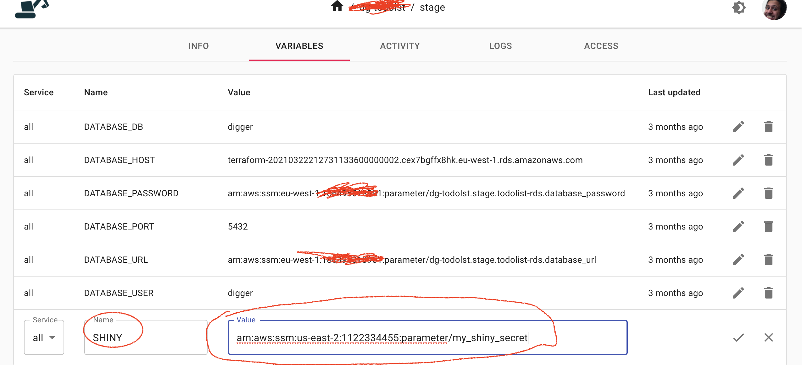

# Secrets

Digger has a unique way of handling secrets by never storing them. We will integrate with yor cloud provider to store your secrets in your own account and then at every release we load the secret in your app. In this way Digger never sees your secrets and sensitive data.

Let us look at the steps creating a secret in your AWS account using ParameterStore and integrating this in your service so that your application can read it.

First of all go to the parameterstore section by searching for it:


Next step is to click on create parameter:


    
Fill in a name, Use a "SecureSecret" as a type and then fill in your sensitive value:


Now click on "Create parameter" button. In the next step we need to tell digger to fetch this secret value. To do this we need to prepare the ARN for this value. An ARN value is AWS's unified way of labelling any resource that you create. Usually in most views the ARN value is visible in UI but unfortunately this is not the case for ParameterStore and hence we need to construct it ourselves. Here is the format of the ARN value for ParameterStore:

```
arn:aws:ssm:REGION:ACCOUNT_ID:parameter/PARAM_NAME
```

Where:

- ACCOUNT_ID: is the numeric account ID of your AWS account
- REGION: is the current region code for example us-east-1
- PARAM_NAME is the name of the parameter as you just typed it in the step above

in yoour case lets assume our account ID is 1122334455 and our region is eu-west-1. In this case the ARN value will be:

```
arn:aws:ssm:us-east-2:1122334455:parameter/my_shiny_secret
```

Keep this value at hand and then head over to [app.digger.dev](https://app.digger.dev). Navigate to your project and then select the environment you wish to add variable to. Go to the variables section, it should look like this:



Once you add an entry you just need to trigger a release (using `dg env release` command) and your app can now access the secret under the `SHINY` environment variable!
